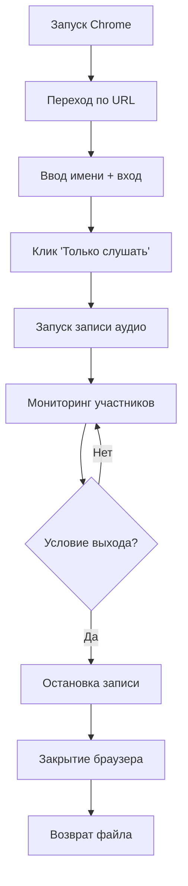

# Recorder — Модуль записи лекций с BigBlueButton

## Обзор

Модуль [`recorder.py`](../core/recorder.py:1) автоматизирует запись лекций с платформы BigBlueButton (BBB) через браузерную автоматизацию (Selenium) и запись системного аудио (FFmpeg).

## Архитектура

```
BBBRecorder (основной класс)
    ├── Selenium WebDriver → подключение к BBB, навигация
    └── SystemAudioRecorder → FFmpeg запись системного аудио
```

## Компоненты

### 1. [`get_stereo_mix_device_name()`](../core/recorder.py:36)

Вспомогательная функция для поиска аудиоустройства "Стерео микшер" в системе.

**Логика работы:**
```
FFmpeg → список устройств → поиск "Стерео микшер" / "Stereo Mix" → название устройства
```

- Запускает FFmpeg с флагом `-list_devices true`
- Парсит вывод для поиска стерео микшера
- Поддерживает UTF-8 и CP1251 кодировки
- Возвращает название устройства или дефолтное значение "Стерео микшер"

---

### 2. [`SystemAudioRecorder`](../core/recorder.py:80)

Класс для записи системного аудио через FFmpeg.

#### Инициализация

- Генерирует имя файла: `lecture_YYYYMMDD_HHMMSS.mp3`
- Сохраняет в директорию `RECORDINGS_DIR`
- Находит аудиоустройство через [`get_stereo_mix_device_name()`](../core/recorder.py:36)

#### [`start()`](../core/recorder.py:92)

Запускает FFmpeg как фоновый процесс для записи системного аудио:

```bash
ffmpeg -y -f dshow -i "audio=Стерео микшер" -acodec libmp3lame -b:a 192k lecture_20260313_200810.mp3
```

**Параметры:**
- `-y` — перезаписать файл без подтверждения
- `-f dshow` — формат DirectShow (Windows)
- `-i audio=...` — входное аудиоустройство
- `-acodec libmp3lame` — кодек MP3
- `-b:a 192k` — битрейт 192 kbps

#### [`stop()`](../core/recorder.py:126)

Останавливает FFmpeg:
- Отправляет команду `q` в stdin для graceful остановки
- Если не отвечает за 5 секунд — принудительно завершает через `kill()`
- Возвращает путь к записанному файлу или `None`

---

### 3. [`BBBRecorder`](../core/recorder.py:146)

Основной класс для записи лекций с BigBlueButton.

#### Параметры инициализации

| Параметр | По умолчанию | Описание |
|----------|--------------|----------|
| `url` | — | URL лекции BBB (обязательный) |
| `user_name` | "Студент" | Имя пользователя для входа |
| `min_participants` | 5 | Минимум участников для мониторинга |
| `history_size` | 60 | Размер истории участников |
| `check_interval` | 5 сек | Интервал проверки количества участников |
| `filename` | auto | Имя файла для записи |

#### [`start_session()`](../core/recorder.py:180) — Основной метод

Полный цикл записи лекции.

**Поток выполнения:**



**Шаги:**

1. **Запуск Chrome** — с настройками для медиа-стримов (`--use-fake-ui-for-media-stream`)
2. **Переход по URL** — загрузка страницы лекции BBB
3. **Авторизация:**
   - Ожидание поля ввода имени (`input[id$='join_name']`)
   - Ввод имени пользователя
   - Нажатие кнопки "Присоединиться" (`#room-join`)
4. **Выбор аудиорежима:**
   - Поиск кнопки "Только слушать" (рус/англ варианты)
   - Клик по кнопке
   - Ожидание 5 секунд для подключения
5. **Запуск записи** — [`SystemAudioRecorder.start()`](../core/recorder.py:92)
6. **Мониторинг сессии** — [`_monitor_session()`](../core/recorder.py:247)
7. **Завершение** (блок `finally`):
   - Остановка записи [`SystemAudioRecorder.stop()`](../core/recorder.py:126)
   - Закрытие браузера `driver.quit()`
   - Возврат пути к файлу

#### [`_monitor_session()`](../core/recorder.py:247) — Мониторинг участников

Цикл мониторинга, который отслеживает количество участников и определяет момент завершения записи.

**Условия завершения записи:**

| Условие | Проверка | Описание |
|---------|----------|----------|
| Браузер закрыт | `not self.driver.window_handles` | Пользователь закрыл окно |
| Встреча завершена | Текст "Сеанс завершен" / "Meeting ended" | BBB завершил сессию |
| URL изменился | `logout` или `ended` в URL | Перенаправление на страницу выхода |
| **Аудитория покинула** | `ratio <= 0.35` | 65%+ участников вышло |

**Алгоритм определения выхода аудитории:**

```python
# Каждые check_interval секунд (по умолчанию 5):
current_people = текущее_количество_участников
participants_history.append(current_people)

peak = max(participants_history)  # Пиковое количество за историю
ratio = current_people / peak     # Текущее / пиковое

# Период прогрева: первые 20 проверок не учитываются
# После прогрева: если peak >= min_participants и ratio <= 0.35
# → 65%+ аудитории вышло → завершаем запись
```

**Вывод в консоль:**
```
Участников: 15 (Пик: 45) | Осталось: 33%
```

---

## Конфигурация

Настройки импортируются из [`config/settings.py`](../config/settings.py:1):

| Параметр | Значение по умолчанию | Описание |
|----------|----------------------|----------|
| `BBB_USER_NAME` | "Студент" | Имя для входа в лекцию |
| `BBB_MIN_PARTICIPANTS` | 5 | Минимум участников для активации мониторинга выхода |
| `BBB_HISTORY_SIZE` | 60 | Размер истории участников (для определения пика) |
| `BBB_CHECK_INTERVAL` | 5 | Интервал проверки количества участников (секунды) |
| `RECORDINGS_DIR` | `data/recordings/` | Директория для сохранения записей |
| `FFMPEG_AUDIO_CODEC` | libmp3lame | Аудиокодек |
| `FFMPEG_AUDIO_BITRATE` | 192k | Битрейт аудио |

---

## Визуальная схема взаимодействия

```
┌─────────────────────────────────────────────────────────┐
│                      BBBRecorder                        │
├─────────────────────────────────────────────────────────┤
│  Selenium WebDriver                                     │
│  ┌─────────┐    ┌──────────┐    ┌──────────────────┐   │
│  │ Chrome  │───▶│ BBB URL  │───▶│ Вход + Аудио     │   │
│  └─────────┘    └──────────┘    └──────────────────┘   │
│                                                         │
│  Мониторинг участников                                  │
│  ┌─────────────────────────────────────────────────┐   │
│  │ while True:                                     │   │
│  │   проверить кол-во участников                   │   │
│  │   если 65%+ вышло → break                       │   │
│  └─────────────────────────────────────────────────┘   │
├─────────────────────────────────────────────────────────┤
│              SystemAudioRecorder                        │
│  ┌─────────────────────────────────────────────────┐   │
│  │ FFmpeg: запись системного аудио → MP3 файл      │   │
│  └─────────────────────────────────────────────────┘   │
└─────────────────────────────────────────────────────────┘
```

---

## Пример использования

```python
from core.recorder import BBBRecorder

# Создание рекордера
recorder = BBBRecorder(
    url="https://bbb.example.com/lecture/abc123",
    user_name="Студент",
    min_participants=5,
    check_interval=5
)

# Запуск записи
recorded_file = recorder.start_session()

if recorded_file:
    print(f"Лекция записана: {recorded_file}")
else:
    print("Не удалось записать лекцию")
```

---

## Зависимости

- **Selenium** — браузерная автоматизация
- **webdriver-manager** — автоматическая установка ChromeDriver
- **FFmpeg** — запись системного аудио (должен быть установлен в системе)
- **Chrome/Chromium** — браузер для подключения к BBB

---

## Особенности

1. **Автоматическое определение окончания лекции** — запись завершается когда 65%+ аудитории покинуло лекцию
2. **Период прогрева** — первые 20 проверок (≈100 секунд) не учитываются для предотвращения ложных срабатываний
3. **Graceful shutdown** — FFmpeg останавливается корректно через команду `q`
4. **Кросс-кодировка** — поддержка UTF-8 и CP1251 для поиска аудиоустройства
5. **Автоматическая установка драйвера** — ChromeDriver устанавливается автоматически через webdriver-manager
