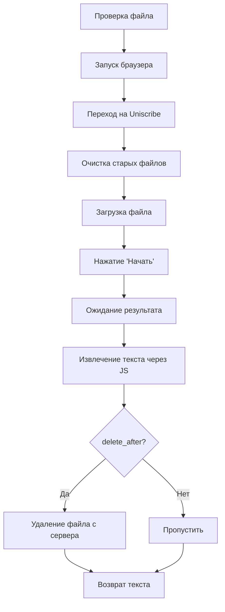

# Transcriber — Модуль транскрибации аудио через Uniscribe

## Обзор

Модуль [`transcriber.py`](../core/transcriber.py:1) автоматизирует транскрибацию аудиофайлов через веб-сервис Uniscribe. Использует Selenium с undetected-chromedriver для обхода защитных механизмов и поддерживает headless-режим.

## Архитектура

```
UniscribeTranscriber
    ├── undetected-chromedriver → браузерная автоматизация
    ├── JavaScript injection → перехват буфера обмена
    └── Uniscribe web service → транскрибация аудио
```

## Класс [`UniscribeTranscriber`](../core/transcriber.py:34)

### Параметры инициализации

| Параметр | По умолчанию | Описание |
|----------|--------------|----------|
| `headless` | `False` | Запуск браузера в фоновом режиме |
| `proxy` | `None` | URL прокси-сервера |
| `max_wait` | `UNISCRIBE_TIMEOUT` | Максимальное время ожидания (секунды) |

### Поддержка контекстного менеджера

Класс поддерживает использование с оператором `with`:

```python
with UniscribeTranscriber(headless=True) as transcriber:
    text = transcriber.transcribe("audio.mp3")
# Браузер автоматически закрывается при выходе из блока
```

---

## Методы

### [`start_browser()`](../core/transcriber.py:68) — Запуск браузера

Запускает Chrome через undetected-chromedriver с настройками:

```python
options = uc.ChromeOptions()
options.add_argument('--no-sandbox')
options.add_argument('--disable-dev-shm-usage')
options.add_argument('--start-maximized')

# Для headless-режима:
if self.headless:
    options.add_argument('--headless=new')
    options.add_argument('--disable-gpu')
    options.add_argument('--window-size=1920,1080')

# Для прокси:
if self.proxy:
    options.add_argument(f'--proxy-server={self.proxy}')

self.driver = uc.Chrome(options=options, use_subprocess=True, version_main=145)
```

**Особенности:**
- Использует `undetected_chromedriver` для обхода антибот-защиты
- Фиксированная версия Chrome (`version_main=145`)
- Автоматический запуск при первом вызове [`transcribe()`](../core/transcriber.py:183)

---

### [`quit()`](../core/transcriber.py:94) — Закрытие браузера

Выполняет полную очистку перед закрытием:

1. Очистка cookies и localStorage ([`_clean_web_data()`](../core/transcriber.py:106))
2. Закрытие браузера `driver.quit()`
3. Сброс `self.driver = None`

---

### [`_clean_web_data()`](../core/transcriber.py:106) — Очистка веб-данных

Очищает куки и хранилище для предотвращения накопления сессий:

```python
self.driver.delete_all_cookies()
self.driver.execute_script("window.localStorage.clear(); window.sessionStorage.clear();")
```

---

### [`_click_safely(element)`](../core/transcriber.py:116) — Безопасный клик

Надежный клик по элементу с fallback на JavaScript:

```python
# 1. Прокрутка к элементу
self.driver.execute_script("arguments[0].scrollIntoView({block: 'center'});", element)
time.sleep(0.5)

# 2. Попытка обычного клика
try:
    element.click()
except WebDriverException:
    # 3. Fallback: клик через JavaScript
    self.driver.execute_script("arguments[0].click();", element)
```

**Зачем:** Элементы могут быть перекрыты другими элементами или модальными окнами.

---

### [`_delete_file()`](../core/transcriber.py:125) — Удаление файла с сервера

Удаляет текущий файл на сайте Uniscribe:

1. Клик по кнопке корзины (`UNISCRIBE_TRASH_BUTTON_XPATH`)
2. Подтверждение удаления (`UNISCRIBE_CONFIRM_DELETE_XPATH`)
3. Ожидание появления кнопки загрузки (признак готовности)

**Возвращает:** `True` если файл удален, `False` если файлов не было или произошла ошибка.

---

### [`_extract_text(copy_btn)`](../core/transcriber.py:153) — Извлечение текста

**Ключевой метод** — извлекает текст транскрипции через перехват буфера обмена JavaScript.

**Проблема:** В headless-режиме `pyperclip` не работает, так как нет доступа к системному буферу обмена.

**Решение:** Подмена функции `navigator.clipboard.writeText` через JavaScript:

```python
# 1. Инъекция JavaScript для перехвата записи в буфер
self.driver.execute_script("""
    window.myBotClipboard = "";
    navigator.clipboard.writeText = function(text) {
        window.myBotClipboard = text;
        return Promise.resolve();
    };
""")

# 2. Клик по кнопке копирования
self._click_safely(copy_btn)

# 3. Чтение перехваченного текста из переменной браузера
for _ in range(20):  # Ждем до 10 секунд
    content = self.driver.execute_script("return window.myBotClipboard;")
    if content and len(content) > 5:
        return content
    time.sleep(0.5)
```

**Алгоритм:**
1. Переопределяем `navigator.clipboard.writeText` чтобы сохранять текст в `window.myBotClipboard`
2. Нажимаем кнопку "Копировать" на сайте
3. Сайт вызывает `writeText()` → текст сохраняется в переменную
4. Читаем переменную из браузера через `execute_script`

---

### [`transcribe(file_path, delete_after)`](../core/transcriber.py:183) — Основной метод

Полный цикл транскрибации одного файла.

**Поток выполнения:**



**Шаги:**

1. **Проверка файла** — убеждаемся что файл существует
2. **Запуск браузера** — если еще не запущен
3. **Переход на сайт** — `self.driver.get(UNISCRIBE_URL)`
4. **Очистка** — удаление старых файлов ([`_delete_file()`](../core/transcriber.py:125))
5. **Загрузка файла:**
   ```python
   file_input = self.driver.find_element(By.XPATH, UNISCRIBE_FILE_INPUT_XPATH)
   file_input.send_keys(str(path.absolute()))
   ```
6. **Запуск транскрибации** — клик по кнопке "Начать"
7. **Ожидание** — ожидание появления кнопки "Копировать" (признак завершения)
8. **Извлечение текста** — [`_extract_text(copy_btn)`](../core/transcriber.py:153)
9. **Удаление файла** — если `delete_after=True`
10. **Возврат текста**

**Обработка ошибок:**
- `TimeoutException` — превышено время ожидания
- `Exception` — другие ошибки (логируются)

---

### [`transcribe_batch(file_paths, delete_after)`](../core/transcriber.py:262) — Пакетная транскрибация

Транскрибация нескольких файлов с паузами между запросами:

```python
results = {}

for file_path in file_paths:
    text = self.transcribe(file_path, delete_after)
    results[str(file_path)] = text
    
    # Пауза 2-5 секунд для имитации реального пользователя
    time.sleep(random.uniform(2, 5))

return results
```

**Возвращает:** Словарь `{путь_к_файлу: текст_транскрипции}`

---

## Конфигурация

Настройки импортируются из [`config/settings.py`](../config/settings.py:1):

| Параметр | Значение по умолчанию | Описание |
|----------|----------------------|----------|
| `UNISCRIBE_URL` | — | URL сервиса Uniscribe |
| `UNISCRIBE_TIMEOUT` | — | Таймаут ожидания элементов (секунды) |
| `UNISCRIBE_MAX_RETRIES` | — | Максимум попыток транскрибации |
| `UNISCRIBE_UPLOAD_BUTTON_XPATH` | — | XPath кнопки загрузки |
| `UNISCRIBE_START_BUTTON_XPATH` | — | XPath кнопки начала транскрибации |
| `UNISCRIBE_FILE_INPUT_XPATH` | — | XPath поля выбора файла |
| `UNISCRIBE_COPY_BUTTON_XPATH` | — | XPath кнопки копирования |
| `UNISCRIBE_TRASH_BUTTON_XPATH` | — | XPath кнопки удаления |
| `UNISCRIBE_CONFIRM_DELETE_XPATH` | — | XPath кнопки подтверждения удаления |
| `PROXY_URL` | `None` | URL прокси-сервера |

---

## Визуальная схема взаимодействия

```
┌─────────────────────────────────────────────────────────┐
│                  UniscribeTranscriber                   │
├─────────────────────────────────────────────────────────┤
│  undetected-chromedriver                                │
│  ┌─────────┐    ┌──────────────┐    ┌───────────────┐  │
│  │ Chrome  │───▶│ Uniscribe    │───▶│ Загрузка      │  │
│  │ (proxy) │    │ URL          │    │ файла         │  │
│  └─────────┘    └──────────────┘    └───────────────┘  │
│                                                         │
│  JavaScript Injection                                   │
│  ┌─────────────────────────────────────────────────┐   │
│  │ navigator.clipboard.writeText = function(text)  │   │
│  │     window.myBotClipboard = text;               │   │
│  └─────────────────────────────────────────────────┘   │
│                                                         │
│  Извлечение текста                                      │
│  ┌─────────────────────────────────────────────────┐   │
│  │ return window.myBotClipboard;                   │   │
│  └─────────────────────────────────────────────────┘   │
└─────────────────────────────────────────────────────────┘
```

---

## Пример использования

### Одиночная транскрибация

```python
from core.transcriber import UniscribeTranscriber

# С контекстным менеджером (рекомендуется)
with UniscribeTranscriber(headless=True) as transcriber:
    text = transcriber.transcribe("lecture.mp3")
    if text:
        print(f"Получено {len(text)} символов")
        print(text[:200])
```

### Пакетная транскрибация

```python
from pathlib import Path
from core.transcriber import UniscribeTranscriber

files = list(Path("source/").glob("*.mp3"))

with UniscribeTranscriber(headless=True) as transcriber:
    results = transcriber.transcribe_batch(files, delete_after=True)
    
    for file_path, text in results.items():
        if text:
            print(f"✅ {file_path}: {len(text)} символов")
        else:
            print(f"❌ {file_path}: ошибка")
```

### С прокси

```python
with UniscribeTranscriber(
    headless=True,
    proxy="http://proxy.example.com:8080"
) as transcriber:
    text = transcriber.transcribe("lecture.mp3")
```

---

## Зависимости

- **undetected-chromedriver** — обход антибот-защиты
- **Selenium** — браузерная автоматизация
- **Chrome/Chromium** — браузер (версия 145)

---

## Особенности

1. **Обход антибот-защиты** — использование `undetected_chromedriver` вместо стандартного Selenium
2. **Headless-совместимость** — перехват буфера обмена через JavaScript вместо `pyperclip`
3. **Безопасные клики** — fallback на JavaScript при невозможности обычного клика
4. **Очистка сессий** — автоматическая очистка cookies и localStorage
5. **Имитация пользователя** — случайные паузы между запросами (2-5 секунд)
6. **Автоматическая очистка** — удаление файлов с сервера после транскрибации
7. **Контекстный менеджер** — автоматическое закрытие браузера

---

## Отличия от стандартного подхода

| Стандартный подход | Данный модуль |
|-------------------|---------------|
| `pyperclip.paste()` для буфера | JavaScript injection |
| Обычный ChromeDriver | undetected-chromedriver |
| Ручное закрытие браузера | Контекстный менеджер |
| Нет очистки сессий | Автоочистка cookies/storage |
| Фиксированные задержки | Случайные паузы (anti-detection) |
